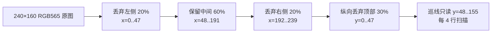
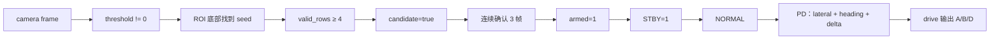
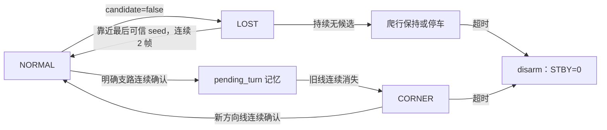
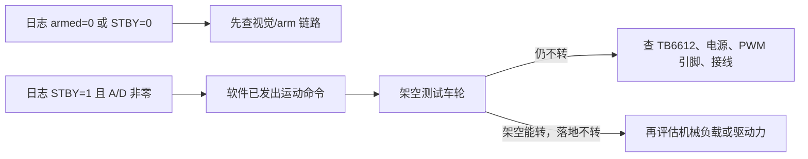

# Camera Line-Follow：横向流程与现场诊断

> 本文对应 `camera_display.c`、`camera_line_follow.c` 和 `tft_st7735.c` 的当前实现。
> Mermaid 图均使用从左到右（LR）布局。

## 1. 从摄像头到电机的完整链路

```mermaid
flowchart LR
    A[UVC 摄像头<br/>MJPEG 彩色帧] --> B[JPEG 解码<br/>RGB565 彩色 buffer]
    B --> C[ROI 内亮度统计<br/>x=20%~80%<br/>y=30%~100%]
    C --> D[自适应 threshold<br/>限幅 + 低通]
    D --> E[巡线回调<br/>可写 RGB565 buffer]
    E --> F[逐行 luma 判断<br/>luma ≤ threshold]
    F --> G[黑色连续线段<br/>选择中心点]
    G --> H[points[] 中心点序列]
    H --> I[seed_x / valid_rows<br/>误差 / 支路信息]
    I --> J{candidate?}
    J -->|否| K[LOST：局部重捕获]
    J -->|是| L[arm 或 NORMAL/CORNER 控制]
    L --> M[drive(forward, turn)]
    M --> N[A/B/D 有符号 PWM]
```

摄像头缓存始终是彩色 RGB565；巡线并没有生成或保存一张完整黑白图。识别时只是对 ROI 内每个像素即时计算亮度 `luma`，再用 `luma <= threshold` 做黑/非黑判断。TFT 显示的仍是原始彩色帧。

当前这台摄像头没有 `320×240` 模式，日志显示实际协商为 `480×320@15 FPS`，解码缩放后约为 `240×160`。因此 ROI 横向有效范围约为 `x=48..191`。

## 2. ROI（巡线输入视野）



左右和顶部裁剪同时用于自适应阈值统计与逐行找线，所以环境中的椅子脚不会参与首次 seed 竞争，也不会影响阈值。底部没有再按百分比裁掉，只跳过最底部约 4 行作为边界保护。TFT 仍显示完整原图，这是调试显示，不是巡线输入。

## 3. 首次获取 seed 与局部逐行跟踪

```mermaid
flowchart LR
    A[没有历史 seed] --> B[ROI 底部附近起扫]
    B --> C[当前行扫描 ROI 全宽]
    C --> D[找黑色连续段]
    D --> E[选离图像中心最近的合理段]
    E --> F[得到底部 seed_x]
    F --> G[向上每 4 行扫描]
    G --> H[后续行只在 seed 附近窗口找段]
    H --> I[限制相邻中心跳变]
    I --> J[追加 line_point_t 到 points[]]
    J --> K{valid_rows ≥ 4?}
    K -->|是| L[candidate=true]
    K -->|否| M[candidate=false]
```

每个黑色线段还会受到最小宽度、最大宽度和中心跳变限制。没有第二套检测结果，TFT 上的绿色点就是 `points[]` 本身；红色十字是底部 seed。

## 4. arm 条件与正常控制



`heading_error` 只在 `NORMAL` 的连续转向控制中使用，不单独触发支路或 `CORNER`。

## 5. 三态状态机



`LOST` 重捕获固定围绕最后可信 `seed_x`，窗口逐步扩大，但候选必须先靠近该 seed；因此不会再把 `heading_error` 当作像素位移，把搜索点甩到图像另一侧的椅子脚。

## 6. TFT 调试链路

```mermaid
flowchart LR
    A[当前 RGB565 帧] --> B{到达刷新间隔?}
    B -->|否| C[不画 overlay，不刷 TFT]
    B -->|是| D[回调在原帧上画稀疏 points[]]
    D --> E[画红色 seed 十字]
    E --> F[按 2×2 取左上像素]
    F --> G[逐 TFT 行 line buffer]
    G --> H[SPI 刷原始彩色图]
```

当前刷新间隔约 400 ms（约 2.5 FPS），不会把摄像头处理和控制刷新强行降到 TFT 刷新频率。

## 7. 电机“不动”的判断方法



日志中的 `motor[A,B,D]=[-20,-2,24]` 表示 A、D 已有约 20%~24% 的 PWM 命令，B 接近零是当前混控下的结果；仅凭这条日志不能认定“驱动力不足”。如果架空时 A/D 仍完全不转，优先级应是硬件/PWM/STBY，而不是立刻提高速度参数。
