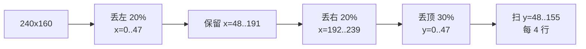
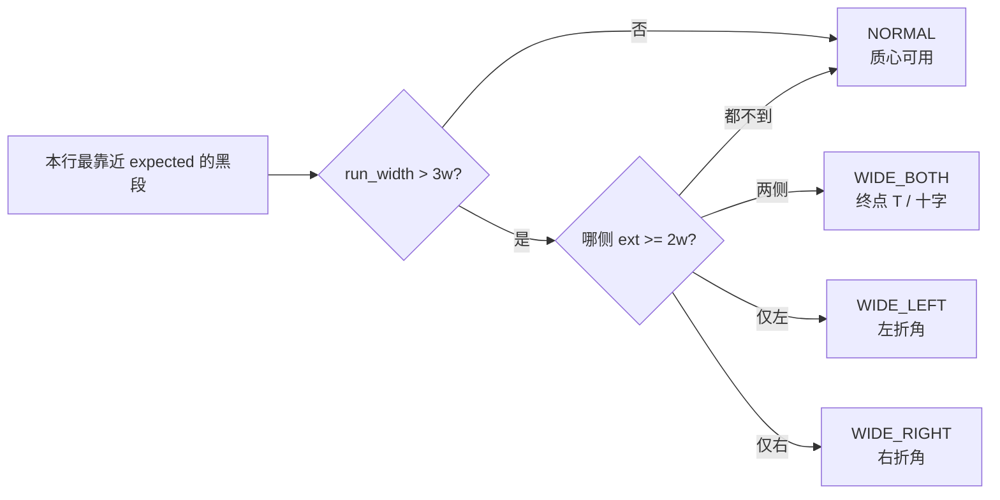
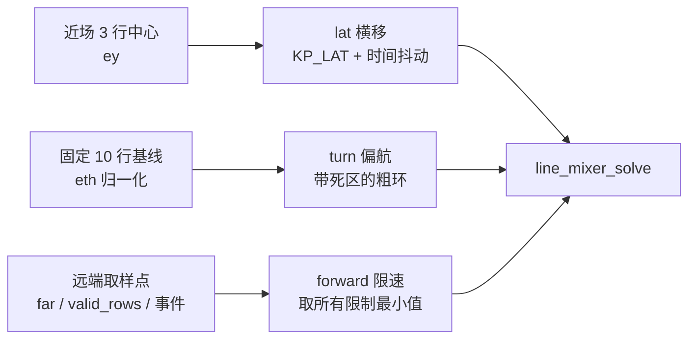
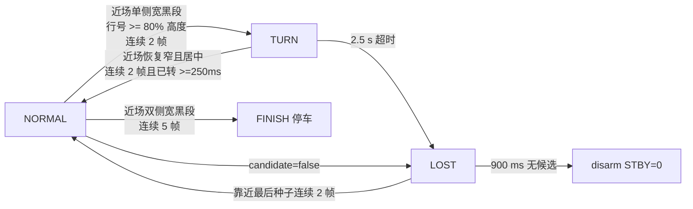
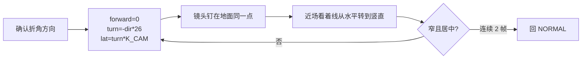
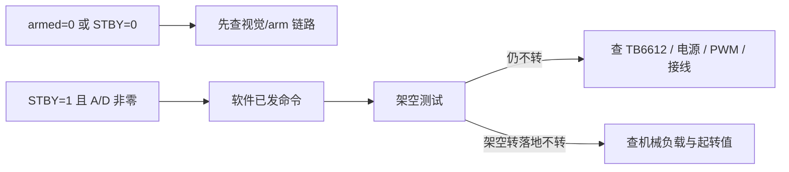

# Camera Line-Follow：横向流程与现场诊断

> 对应 `line_geometry.{c,h}`、`line_mixer.{c,h}`、`camera_line_follow.c`、
> `camera_display.c`。Mermaid 图均为从左到右（LR）布局。
> 离线回归见 `test/README.md`。

## 1. 从摄像头到电机的完整链路

```mermaid
flowchart LR
    A[UVC MJPEG] --> B[JPEG 解码<br/>RGB565 240x160]
    B --> C[ROI 亮度直方图<br/>x=20%~80% y=30%~100%]
    C --> D[自适应 threshold<br/>限幅 + 低通]
    D --> E[逐行扫描<br/>line_geometry_track]
    E --> F[每行黑段形状分类]
    F --> G[NORMAL 行 -> points[]<br/>WIDE 行 -> 事件]
    G --> H[ey / eth / far / 事件]
    H --> I[状态机<br/>NORMAL TURN LOST FINISH]
    I --> J[三通道<br/>forward turn lat]
    J --> K[line_mixer_solve<br/>整向量等比缩放]
    K --> L[A/B/D 有符号 PWM]
```

摄像头缓存始终是彩色 RGB565，识别时只对 ROI 内像素即时算亮度，没有生成过
黑白图。TFT 显示的是原始彩色帧加稀疏 overlay。

## 2. ROI



ROI 横向不能再放宽：板外是深色切割垫和桌面，一旦越过板边缘就是一整片"黑"。
也不能再收窄：终点 T 的横杆只有 10 cm，近场必须能同时看到它的两端，否则
终点和直角弯无法区分。误差按 `width/2` 归一而不是按 ROI 归一，**改 ROI 会
同时静默改变所有增益和门限的等效标度**。

## 3. 每行黑段的形状分类（整套逻辑的核心）

搜索窗口是 `expected ± half_window`。**被窗口边界截断的黑段，其质心由窗口
位置决定而不是由赛道决定** —— 直角弯的横条、终点横杆、大片阴影都会命中这
种情况。所以每行先分类，只有 NORMAL 行的质心能当赛道位置用。

判据全部相对近场线宽 `w`（近场线宽 EMA，未知时回退到图宽 4%）：



代入实测尺寸：胶带约 1.5 cm，终点横杆 10 cm ≈ 6.7w，两侧各外伸约 3.3w，
稳稳落在 2w 门限之上；直角弯的去线只在一侧无限延伸。两个门限之间有 4 倍
余量，所以 `w` 估偏 40% 也不会翻判。

WIDE 行不写入 `points[]`，只记录方向和所在行号，然后结束向上跟踪。这一条
同时解决三件事：假质心不再污染误差、跟踪器不再沿横条向外走、直角弯第一次
有了可靠的检测信号。

## 4. 三条解耦的控制通道

全向底盘能直接平移，所以横向偏差用**平移**修正（一阶，对 400~600 ms 环路
延迟免疫），不必靠旋转（二阶，必然过冲）。



两个硬件起转值决定了通道形态：B 轮实测 13，A/D 实测 11。kiwi 混控下后轮只
承担 `turn`，所以小幅偏航指令根本推不动后轮；纯横移也要求 `|lat| ≥ 11`
（A/D 各承担一份 lat）。**两条通道都做时间抖动**：需求量低于起转值时攒进
累加器，攒够了发一个整脉冲，15 FPS 下是几 Hz 的脉冲串，车体自己积分掉，
等效平均值就是需求值。这比"把死区一直开到起转值对应的误差"好得多 —— 后者
在这台车上相当于容忍十几度的姿态误差。

符号关系是最容易写错的地方，而且在"误差为 0 的合成图"上完全看不出来（转向
和平移是两个不同的执行器，和误差符号的关系不一样）：

```
lateral_error > 0  线在画面中心左侧 -> 车在线右边 -> 要向左平移 -> lat  = -K*ey
heading_error < 0  线的远端偏左                 -> 要左转     -> turn = -K*eth
turn > 0 = 逆时针 = 左转          lat > 0 = 向右平移（+x）
```

`test/host_harness.c` 的 `sign-*` 用例把整条链路（几何 → 控制律 → 混控 →
车体速度）钉住：线偏左时车体 `vx < 0`，远端偏左时车体 `ω > 0`。

## 5. 状态机



远处看见折角只降速，不转向：**触发转弯要求事件行落到画面下方 80% 以内**。
这就是"看得太远会提前转向"的正面解决 —— 远端信息只进限速通道。

出弯后 900 ms 内限速，因为赛道右上角两个直角弯之间只有 10 cm（20 cm/s 下
只有 0.5 秒）。

## 6. TURN：绕摄像头旋转

摄像头装在 D、A 之间，在旋转中心**前方** `a` 处。纯原地旋转会让镜头横扫
`a·θ`，90° 弯就扫过约 1.57a，线必然荡出视野 —— 这是原来只能盲转+外推的
根本原因。叠加 `lat = turn · a/(2L)` 就把旋转中心挪到镜头上：



偏航量必须够大：`a = lat - turn ≈ -0.5·turn`，turn 给小了 A/D 会掉到起转值
以下被混控丢弃，只剩后轮在推。混控单元测试钉住了这一点：

```
pivot(26) -> a=-12 b= 50 d=-12   实际 (f=0, t=24, l=12)   lat/turn=0.5 正确
pivot(19) -> a=  0 b= 37 d=  0   A/D 被丢弃，退化成只有后轮
```

## 7. 混控（120° 三轮全向轮）

```
a = -forward - turn +   lat
d = +forward - turn +   lat
b =            turn + 2*lat
```

配合 car-spin 实车校准的极性（A=1, B=1, D=-1）。**纯直行时 b == 0 是正确的
全向轮行为**，不是"后轮没工作"。超上限时整向量等比缩放，绝不单边削顶：在
全向底盘上单独裁一个分量会把指令向量整体转向。低于起转值的分量置零而不是
抬到起转值（抬值的失真更大：turn=1 抬到 13 就是 13 倍偏航）。

`MOTOR_PWM_CEILING`（硬件/安全上限）和 `LINE_SPEED_CAP`（速度意图）现在是
两个独立的量。原来都压在 `MAX_OUTPUT=34` 上，`FORWARD_FAST=30` 时转向预算
只剩 4，`LINE_TURN_MAX 19` 根本到不了。

## 8. 还没实测的常数（源码里都标了 `TODO(实测)`）

| 常数 | 含义 | 怎么测 |
| --- | --- | --- |
| `LINE_CAM_PIVOT_PERCENT` | `a*100/(2L)` | 尺子量：`a`=中心到镜头前向距离，`L`=中心到轮子接地点 |
| `LINE_PID_KP_LAT` | 横移增益 | 先测 `lat` 单位对应多少 cm/s 侧移 |
| `LINE_PID_KH` | 偏航增益 | 先测 `turn` 单位对应多少 deg/s |
| `MOTOR_TRIM_A` / `_D` | 直行配平 | 落地跑 3 s 看跑偏方向 |
| `MOTOR_PWM_CEILING` | 安全上限 | 按实测最高安全轮速调 |
| `LINE_SATURATION_GUARD` | 彩色守卫 | 采到红球的真实帧后再决定是否开 |

测速度和死区都不需要仪器，加一段校准脚本即可：逐级抬高单一通道各 1.5 s
（`drive(v,0,0)` / `drive(0,v,0)` / `drive(0,0,v)`），眼看第几级开始动，就是
该通道的静摩擦死区；再定时跑 3 s 用卷尺量位移就是 cm/s；旋转最好测——固定
`turn` 跑 10 s 数圈数。

最近扫描行的落地距离不用另想办法：**overlay 的红十字就画在扫描底行上**，
地上放一条胶带，前后挪动直到红十字压在胶带上，量胶带到前轮轴的距离。

## 9. 电机"不动"的判断



日志字段：`state armed candidate threshold seed_x line_w valid_rows confidence
lateral_error heading_error turn_dir STBY motor[A,B,D]`。`line_w` 是近场线宽
（px），第 3 节所有相对判据都以它为基准，实车第一件事就是确认它合理。


