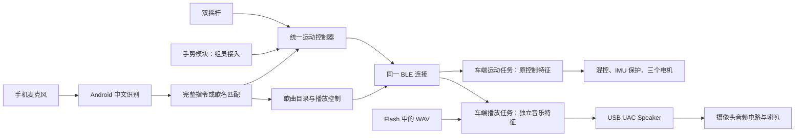

# subject3-ASR：手机语音控车与车载音乐

**同一个安卓 APP 保留双摇杆，加入手机中文语音、车端预存歌曲播放，并提供独立的手势接入接口。** 语音由手机识别，ESP32-S3 用自带 BLE 接收命令，无需额外蓝牙模块。摄像头麦克风不参与手机语音方案。

安卓源码在 [gesture-android](../gesture-android)，版本 **1.3-asr-music / versionCode 4**，首页标识 ASR-2。已有 APK 不会自动增加这些功能，须重新构建。车端已实现 USB UAC WAV 播放代码，**尚未验证实物的 USB 扬声器兼容性或播放效果**。当前曲库仅有 6 秒生成的“测试音”；真实歌曲需要预先导入，不支持说任意歌名后联网搜歌。

## 硬件与流程

| 硬件 | 依据与结论 |
| --- | --- |
| 主控 | 仓库按 ESP32-S3-WROOM-2-N32R16V 配置，32MB OPI Flash / 16MB PSRAM；本机未读取实物芯片。本方案不启用 PSRAM。 |
| 蓝牙 | S3 内置 BLE；原 APP 通过 GATT 发运动帧。S3 不支持经典蓝牙 A2DP，不能直接当蓝牙音箱。 |
| 运动 | 沿用 `gesture-car` 的 A 右前、D 左前、B 后轮三轮全向混控、TB6612 与 IMU 保护。 |
| 摄像头 | [接口图](../../USB三合一摄像头接口说明.png) 标注 JQ-CAM12-720P-V1、720P、5V、USB D-/D+、麦克风和喇叭接口。 |
| 音频待确认 | 图中没有 UAC 版本、采样率、声道、位宽或 USB 描述符；喇叭插座不等于已确认的 USB UAC Speaker。图中还提示不同版本的音频功能可能不同。 |

对手机说话时，**手机麦克风采音**，声音不会因为连接 BLE 就自动进入小车摄像头的麦克风。手机把识别结果转换为短命令，车端执行。



歌曲播放不需要手机持续发送声音。手机继续识别“前进”等指令时，只更新运动通道，车端播放器继续读文件、输出 USB 音频。手机语音服务即便发出提示音，也不占用这条车端音频链路；环境中的歌曲声仍可能影响手机识别准确率，需要实测音量和距离。

## 同一 APP 的操作

1. 小车上电后等 IMU 校准，APP 打开蓝牙、扫描并连接自己的车。默认组号 1。BLE 已连接不代表电机 READY。
2. 选择“摇杆 / 语音 / 手势”。切换模式会撤销运动，只有当前模式能提交运动。急停按钮始终可见。
3. 摇杆模式左杆二维平移，右杆左右旋转，支持组合输入；任一杆松开，两杆归零，须松手后重新触摸。
4. 语音模式点击“说运动指令”，再说完整指令。每轮先停车再采音，只执行最终识别结果；一次动作最长目标时长 0.8 秒。
5. 音乐区在所有模式下可用。点击“语音点歌”说“播放测试音”或“测试音”，也可直接选曲点击播放。之后切到语音模式再说“前进”，音乐继续。
6. 手势识别算法由组员提供，目前界面如实显示未接入。接口与独立测试方法见 [FEATURES.md](../gesture-android/FEATURES.md)。

| 语音 | 三轴 forward / lateral / rotation | 行为 |
| --- | --- | --- |
| 前进、向前、向前走 | +25 / 0 / 0 | 前进约 0.8 秒 |
| 后退、向后、向后退 | -25 / 0 / 0 | 后退约 0.8 秒 |
| 左移、向左平移 | 0 / +25 / 0 | 左移约 0.8 秒 |
| 右移、向右平移 | 0 / -25 / 0 | 右移约 0.8 秒 |
| 左转、左旋、逆时针旋转 | 0 / 0 / +25 | 原地左旋约 0.8 秒 |
| 右转、右旋、顺时针旋转 | 0 / 0 / -25 | 原地右旋约 0.8 秒 |
| 停止、停车、停下 | 0 / 0 / 0 | 停车，音乐继续 |
| 急停、紧急停止 | ESTOP | 电机锁定，音乐继续，需点击解除急停 |
| 播放 + 歌名，或目录中的完整歌名 | 音乐命令 | 播放车端已导入的对应歌曲 |
| 暂停音乐、继续播放、停止音乐 | 音乐命令 | 明确操作播放器 |

“旋转”“向左”“不要前进”“前进然后右转”“前进一米”等模糊、否定或复合运动指令不执行。歌名与运动词重名时使用“播放 + 歌名”。未知歌名、目录不一致或坏 WAV 不会替换正在播放的歌曲。

25 是原协议三轴满量程，编码成 ±2500，既不是角度也不是 PWM 百分比。车端最大输出仍为 **30% PWM**。0.8 秒由 `DriveController.kt` 限定，不是精确位移或角度控制；实际停车受通信延迟、速度斜坡和惯性影响。

### 识别与保护边界

- **点击后识别一次**，没有后台常听或唤醒词。行走中直接喊停不会开启新一轮识别；可点击急停，或等待动作到期。
- Android 12 / API31 以上若有本地识别服务则优先使用，否则调用系统服务并提示可能联网。本地服务存在不代表已安装中文模型；可勾选“系统语音服务（可能联网）”重试。
- 缺少中文服务、拒绝权限、识别失败或等待超过 8 秒，都保持停车。输入法可以语音输入不代表它向本 APP 提供系统识别服务。
- APP 要求最近 500ms 内的正常车端状态、READY 和至少 350ms 中立期才接受新动作。手势图像时间戳过期、来源不符、非法轴值会被拒绝。
- 运动输入过期后必须重新启用，不自动恢复旧请求。切换模式、急停、断连、锁屏、切后台会撤销运动与待返回的识别回调。
- 车端保留 250ms 失联停车、至少 300ms 回中重新使能、IMU 故障和倾覆保护。原 14 字节协议没有车端动作时长字段，因此 0.8 秒动作期限仍由 APP 管理。
- **停车、急停、切后台、BLE 断连都不停止已开始的音乐**；需要停止音乐时使用独立按钮或音乐命令。USB 拔出会终止播放，插回不会自动续播。上电不自动播放。

## 接线与工程复用

`main/ble_car.c`、电机、显示和引脚文件以仓库 `gesture-car/main` 为基线，公共协议、混控、IMU 和 BLE 引用 `../gesture-common`。公共 BLE 只增加可选服务注册/通知钩子；原车端与遥控端继续使用原启动 API。实际改动范围以 Git diff 为准。

| 外设 | GPIO |
| --- | --- |
| A 右前 PWM / IN1 / IN2 | 9 / 12 / 10 |
| B 后轮 PWM / IN1 / IN2 | 4 / 6 / 5 |
| D 左前 PWM / IN1 / IN2 | 16 / 7 / 15 |
| TB6612 STBY | 8 |
| IMU SDA / SCL | 17 / 3 |
| USB D- / D+ | 19 / 20 |
| UART0 日志 TX / RX | 43 / 44 |

沿用电机方向 A=+1、B=+1、D=-1。GPIO17/3 已给 IMU，不能同时接原 B 轮编码器；GPIO3 是绑带脚，沿用现有已验证接线。TFT 默认关闭，GPIO1/2 不驱动舵机。

摄像头接稳定的 5V 与共地，按端子标识核对 D-/D+，不要仅凭线色判断。麦克风/喇叭 2Pin 接模块对应外设，不是 ESP32 I2S 引脚。USB Host 占用 GPIO19/20 时，不能同时用这些引脚连电脑作 USB Device；使用独立 UART 下载/日志口，避免两个 5V 电源相互倒灌。本固件仅启用 USB Speaker，不开启视频或麦克风流。

## 歌曲准备

具体示例见 [music/README.md](music/README.md)。先准备自己需要的音频，转换成 **单声道 PCM16 WAV**，默认 16000Hz；在 `music/library.json` 配置 ID、歌名、别名和文件路径，然后从仓库根目录运行：

```powershell
python esp-projects/subject3-ASR/tools/prepare_music.py
```

脚本同时生成车端 `musicfs/<id>.wav`、`musicfs/catalog.id` 和安卓 `assets/music_catalog.json`，使用文件内容及名称计算同一 CRC32 指纹。它检查重名、重复 ID、格式和容量。每次更换曲库后要重新构建 APP 和车端文件系统镜像；指纹不一致时拒绝选曲，防止同一编号播放错误歌曲。

默认 16kHz 为功能实验音质，每分钟约 1.92MB。24MiB SPIFFS 按 70% 内容上限约存 9 分钟音频。若设备只支持 48kHz，需同步改 `library.json`、转换文件与 `menuconfig` 的 Speaker rate，容量也会减少。当前没有重采样、MP3 解码、SD 卡或在线曲库。

若以后要求手机上的任意本地/在线歌曲，可保留现有运动与 `MediaSink` 接口，另做“手机解码 → Wi-Fi 音频流 → USB 播放”。这需要歌曲来源、配网、缓冲、解码和传输协议。当前 BLE 协议只传控制命令，没有实现音频传输；不应把它当成 A2DP。另一条硬件方案是额外购买经典蓝牙音频模块，但本版不需要它。

## 在另一台电脑构建

### 车端

打开根目录 [Subject3-ASR.code-workspace](../../Subject3-ASR.code-workspace)。参考仓库既有 **ESP-IDF 5.5.4**，依赖声明支持 5.4/5.5 系列，固定 `espressif/usb_stream=1.5.2`。不直接迁移到 IDF 6.x。

```powershell
$env:PYTHONUTF8='1'
cd esp-projects/subject3-ASR
idf.py -B build-local build
```

目标 `esp32s3`，应用名 `subject3-ASR.bin`；默认 BLE 控车与音乐开启、32MB OPI Flash、240MHz、NimBLE、UART 日志。`partitions.csv` 使用 0x10000 起的 0x3f0000 应用分区，0x400000 起的 24MiB `music` 分区，总地址不超过 32MB。SPIFFS 页大小固定为 **1024 字节**，避免默认 256 字节页下的 16bit 页索引容量限制；镜像生成会使用同一配置。

**已有 `sdkconfig` 不会被 defaults 自动覆盖。** 如果此前构建过无音乐版本，在 `menuconfig → Partition Table` 选择自定义 `partitions.csv`，核对 32MB Flash，并在 `Subject3 ASR preparation` 开启音乐。`Component config → SPIFFS Configuration → SPIFFS logical page size` 设为 **1024**；若旧配置仍为 256，工程会报出构建错误。不要复制旧工程的单应用分区设置。

构建通过 `FLASH_IN_PROJECT` 把 `music.bin` 加入标准工程烧录清单。另一台电脑正常整工程烧录时应包含新分区表与音乐镜像；**只更新 app.bin 不会安装歌曲，也不会切换分区表**。本轮未连接串口、安装 ESP-IDF 或替用户烧录。

纯控车测试可关闭 `Subject3 ASR preparation → USB UAC speaker and music filesystem`；不接 USB 摄像头也可控制电机。音乐目录或 USB 初始化失败会显示错误，不主动禁用正常的运动控制。

### 安卓

用 Android Studio 打开 `esp-projects/gesture-android`，或 JDK17 + SDK35 执行：

```powershell
cd esp-projects/gesture-android
.\gradlew.bat :app:assembleDebug :app:testDebugUnitTest
```

沿用 AGP8.7.3、Kotlin2.0.21、Gradle8.10.2、minSdk26、targetSdk35。本机 SDK 路径自行配置，不照搬他人的 `local.properties`。输出为 `app/build/outputs/apk/debug/app-debug.apk`。

原运动 UUID、组号、14 字节控制帧和 12 字节状态帧不变；新 APP 仍可连接旧 OMNI-2 车端，音乐区提示该固件没有音乐服务。旧 APP 也可遥控新车端。音乐使用单独 GATT 服务，协议见 [FEATURES.md](../gesture-android/FEATURES.md)。

## 真机验收顺序

1. 架空车轮，验证原摇杆六个方向、释放停车、急停、断连与重新启用。再验证手机语音六个方向和到期停车，最后低速落地。
2. 安装匹配曲库的 APP、应用和音乐分区，连接 USB 摄像头。UART 中检查 `music` 的 speaker 格式及 `SELECTED`，确认 **UAC1 Speaker、单声道、16bit 和配置采样率**。APP 中播放“测试音”，确认喇叭实际出声。
3. 若不支持默认格式，先在电脑查看设备 USB Audio 播放接口与格式；只修改为设备确实支持的配置。目前只实现单声道 PCM16；仅支持立体声、UAC2 或没有 USB 播放接口的设备不能直接使用本版。
4. 导入足够长的真实歌曲。播放后反复语音“前进 / 左转 / 停止”、切换摇杆、急停，再断开 BLE，检查音乐连续性。暂停、继续、停止音乐分别验证。
5. 测试未知歌名、曲库不一致、USB 拔插、无曲库分区、语音超时、锁屏与旧回调。观察车轮不自行恢复；USB 拔插后须重新点击播放。

播放器是独立低优先级任务，BLE 回调只排队。PCM 每次 USB 写入限等 20ms，持续 2 秒无进展报错。暂停/停止允许已排入 USB 环形缓冲的少量尾音播放完，默认约 64ms；“播放中”表示数据已提交 USB，不是已经检测到喇叭出声。驱动兼容性、供电和电机运行噪声仍可能影响播放，必须实测。

## 可选车载麦克风诊断

`menuconfig → Subject3 ASR preparation → USB microphone diagnostics; motors disabled` 是独立诊断模式：电机零输出、STBY 拉低，不创建 BLE/运动/音乐任务。USB 麦克风参数初始为 0，匹配设备支持格式；日志列出格式和 `SELECTED`，统计帧与字节，16bit PCM 额外显示 peak/rms。之后可尝试 16000Hz、单声道、16bit。

此诊断只能验证采音，不验证喇叭播放，也不包含 ESP-SR。以后若改为“对车说话”，需另实现 UAC 采音、格式转换、AFE/唤醒词/命令模型和控制仲裁。视频成功、麦克风有音量都不等于语音识别完成。

## 本机验证

```powershell
python esp-projects/gesture-common/test/run_tests.py
python esp-projects/subject3-ASR/test/run_tests.py
```

测试覆盖原协议/混控/状态机/Fusion、PCM 音量、音乐黄金帧、RIFF/WAV 越界与格式检查，以及曲库指纹、输入校验和输出同步。安卓单元测试覆盖指令匹配、控制权、输入超期不恢复、模式切换、状态过期、音乐目录拒绝和独立命令。

2026-09-09：主机 C 测试、4 项 Python 曲库测试及 26 项安卓 JVM 测试通过；所有安卓 Kotlin 源码用 Kotlin2.0.21 对照官方 API35 编译通过。另用 IDF5.5.4 官方脚本验证了 32MB 分区表，并成功生成 1024 字节页的 24MiB 曲库检查镜像（位于忽略的 `build-local/host-tests`，不是整工程固件）。本机没有完整 Android/ESP-IDF 环境，**未进行完整 Gradle APK 打包、ESP-IDF 目标编译或手机/车端实测**，未生成可宣称验证通过的新 APK/烧录固件。

## 参考

- [ESP32-S3 蓝牙支持](https://docs.espressif.com/projects/esp-idf/en/v5.2/esp32s3/api-guides/bluetooth.html)
- [usb_stream UAC1 与主机能力](https://docs.espressif.com/projects/esp-iot-solution/en/latest/usb/usb_host/usb_stream.html)：组件已停止维护，本工程为复用现有环境固定 1.5.2。
- [Android SpeechRecognizer](https://developer.android.com/reference/android/speech/SpeechRecognizer)
- [ESP-SR MultiNet 输入要求](https://docs.espressif.com/projects/esp-sr/en/latest/esp32s3/speech_command_recognition/README.html)
